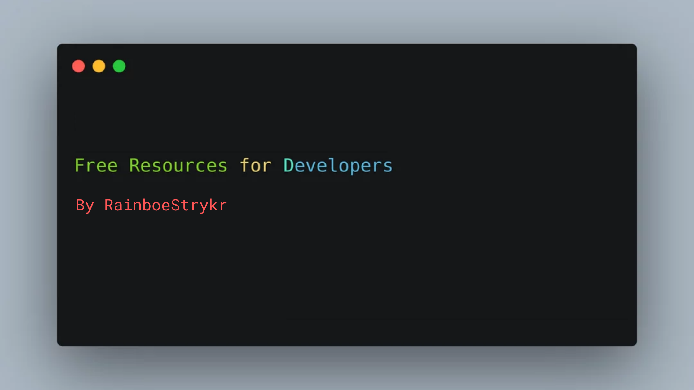

# 😀 Welcome

A curated list of design and UI resources from stock photos, web templates, CSS frameworks, UI libraries, tools and much more

## 📜 Table of Contents

* [Stock Resources](contents/stock-resources.md)
* [CSS Resources](contents/css-resources.md)
* [Javascript Libraries](contents/javascript-libraries.md)
* [JS Framework UI libraries](contents/js-framework-ui-libraries.md)
* [Design Resources](contents/design-resources.md)
* [Chrome Extensions](contents/chrome-extensions.md)
* [UI Components](contents/ui-components.md)
* [HTML / CSS Templates](contents/html-css-templates.md)
* [Vectors and Mockups](contents/vectors-and-mockups.md)
* [Fonts, Icons, and Colors](contents/fonts-icons-and-colors.md)
* [UI Graphics](contents/ui-graphics.md)

## Connect with me

* [Website](https://abhiraj.glitch.me)
* [Twitter](https://twitter.com/rainboestrykr)

Support me here [https://buymeacoffee.com/rainboestrykr](https://buymeacoffee.com/rainboestrykr)

